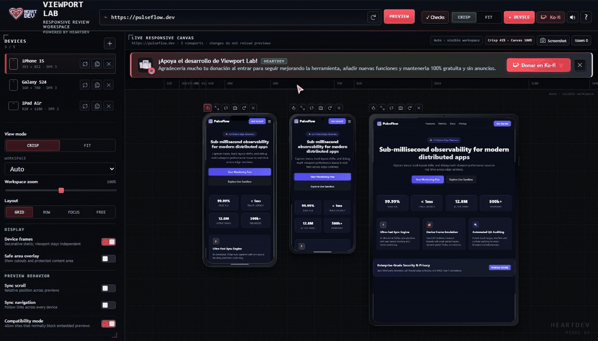
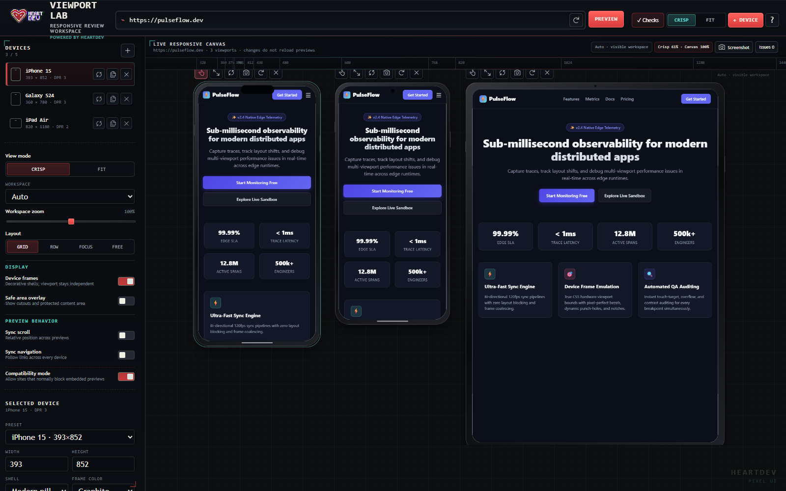
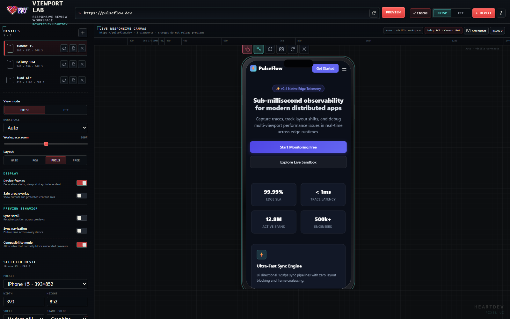
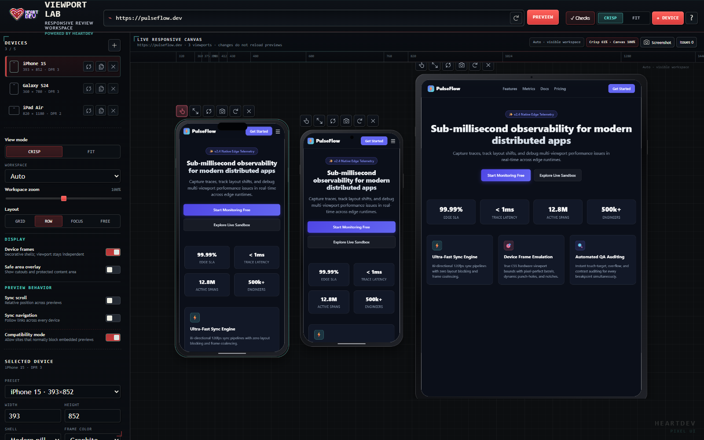
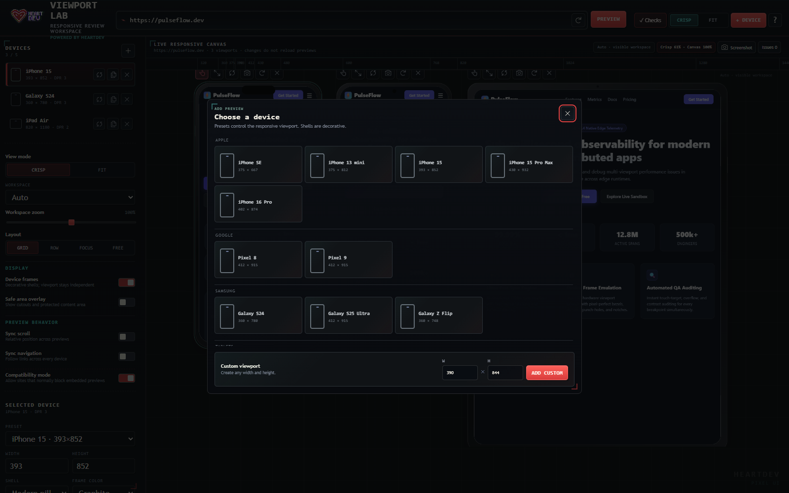
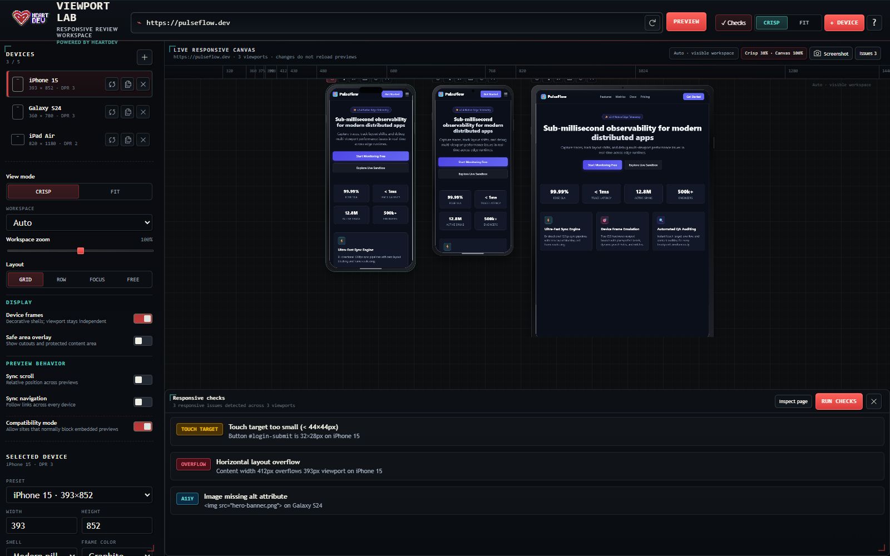
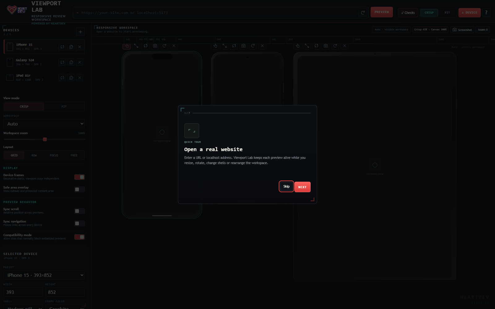
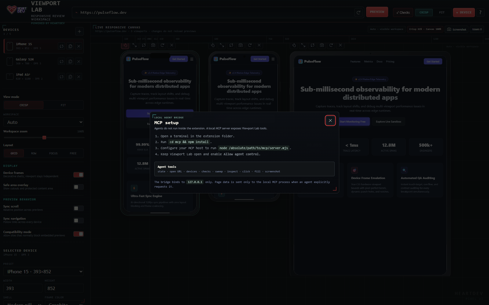
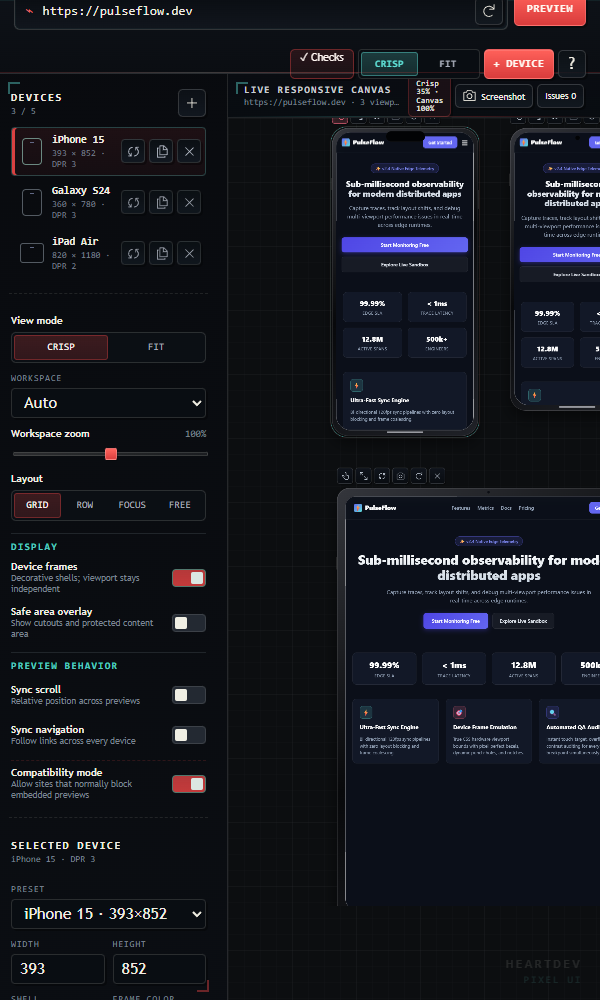

# Viewport Lab

<p align="center">
  
  <br />
  
</p>

<p align="center">
  <strong>Open-source multi-device responsive review and QA workspace for Chrome & Chromium browsers.</strong><br />
  Keep real websites alive inside multiple viewports with zero-reload geometry changes, deterministic QA audits, and an optional local MCP bridge for AI agents.
</p>

<p align="center">
  <a href="LICENSE"></a>
  
  
  
  
  <a href="https://ko-fi.com/heartdevowo"></a>
</p>

<p align="center">
  
  <br />
  <em>Interactive demonstration: Multi-device sync scroll, Row & Focus layouts, hot zero-reload rotation, device presets, and deterministic QA checks. (<a href="assets/viewport-lab-demo.mp4">Download MP4 Video</a>)</em>
</p>

---

## ⚡ Highlights

- **Persistent Previews (Zero-Reload Invariant)**: Resizing, rotating, switching shells, adjusting workspace resolution, changing layouts, or zooming never unmounts or reloads the active website iframes.
- **Side-by-Side Multi-Device Review**: Preview up to 5 concurrent viewports simultaneously with accurate pixel ratios (Apple, Google, Samsung, Tablets, Laptops/Desktops, and Custom viewports).
- **One-Click PNG Screenshots**: Instantly capture and download pixel-perfect PNGs of any device or the complete review canvas directly from the UI.
- **Local Dev Friendly**: Smart URL normalizer detects `localhost`, LAN IPs (`192.168.x.x`, `10.x.x.x`), and dev domains (`.local`, `.test`) without forcing HTTPS, plus auto-saved recent URL history.
- **Crisp vs. Fit Scaling**:
  - **Crisp**: Maximizes 1:1 pixel sharpness within the visible canvas.
  - **Fit**: Proportionally scales all active viewports so the entire device fleet is visible at a glance.
- **Deterministic Responsive QA Checks**: Instantly detect horizontal layout overflow, clipped text, touch targets smaller than 44×44px, missing image `alt` attributes, and unlabelled form controls — no AI hallucinations, purely deterministic.
- **CSS Breakpoint Discovery Ruler**: Automatically parses stylesheets on the previewed page and places interactive pins on an inspection ruler for every `@media (min-width / max-width)` breakpoint.
- **Responsive Sweep Slider**: Scrub continuously across 240px to 1440px to catch layout shifts and breaking points in real time.
- **Declarative Compatibility Mode**: Safely bypasses `X-Frame-Options` and `frame-ancestors` CSP headers on preview subframes using Manifest V3 `declarativeNetRequest` session rules — without compromising top-level browser security.
- **Synchronized Navigation & Smooth Scroll**: Relative lockstep navigation with 60/120fps `requestAnimationFrame` throttled scroll synchronization, echo suppression, and trailing alignment.
- **Local Workspaces**: Save and restore complex device setups directly in `chrome.storage.local`.
- **Optional Local MCP Bridge**: Connect Claude Code, Antigravity, Cursor, or any Model Context Protocol agent to inspect, sweep, click, fill, or screenshot viewports on `127.0.0.1`.
- **100% Local & Auditable**: Zero remote scripts, zero CDNs, zero analytics, zero backend.

---

## 📸 Visual Showcase & Tour

Explore Viewport Lab's workflow, layout modes, inspection tools, and developer utilities in action:

| Multi-Device Responsive Workspace | Focus Mode (1:1 Sharp Single View) |
|:---:|:---:|
| [](assets/screenshots/01-multi-device-workspace.png)<br />*Real-time multi-viewport canvas with Apple, Android & Laptop frames* | [](assets/screenshots/02-focus-mode.png)<br />*Pixel-perfect 1:1 view with quick rotation, shell switching, and inspect tools* |

| Row Layout Comparison | Device Presets Dialog |
|:---:|:---:|
| [](assets/screenshots/03-row-layout.png)<br />*Synchronized horizontal stack with unified scroll & navigation lockstep* | [](assets/screenshots/04-device-presets-dialog.png)<br />*Curated Apple, Google, Samsung, Tablets, Desktops, and custom viewports* |

| Automated Responsive QA Checks | Onboarding & Guided Tour |
|:---:|:---:|
| [](assets/screenshots/05-responsive-qa-checks.png)<br />*Deterministic detection of touch target flaws, layout overflows & missing alts* | [](assets/screenshots/06-onboarding-tour.png)<br />*Interactive step-by-step introduction for first-time developers* |

| MCP AI Agent Bridge | Responsive Sweep & Precision Sidebar |
|:---:|:---:|
| [](assets/screenshots/07-mcp-agent-bridge.png)<br />*Model Context Protocol integration for Claude, Antigravity, and Cursor agents* | [](assets/screenshots/08-responsive-sweep-sidebar.png)<br />*Scrub breakpoints from 240px to 1440px with live CSS media query pins* |

---

## 🚀 Quick Start / Local Installation

Viewport Lab has no build step; it runs on standard browser web technologies.

1. Clone or download this repository:
   ```bash
   git clone https://github.com/HeartDev0/viewport-lab.git
   ```
2. Open your browser's extension manager:
   - Chrome / Brave / Arc: `chrome://extensions`
   - Microsoft Edge: `edge://extensions`
3. Enable **Developer mode** (toggle in the top-right corner).
4. Click **Load unpacked** and select the root `viewport-lab-extension` folder.
5. Navigate to any website or localhost app (e.g. `http://localhost:5173`) and click the **Viewport Lab** icon in your browser toolbar.

---

## 🧭 Key Concepts

### 1. True Viewport Independence
Device shells (pill, notch, punch-hole, clean bezel, tablet) are purely decorative. The underlying iframe receives authentic CSS viewport dimensions. When you rotate or resize a device, CSS media queries trigger naturally without destroying JavaScript state or reloading the page.

### 2. Contained Virtual Canvas
Viewport Lab fits your screen without overflowing or introducing confusing double scrollbars. You can preview in:
- **Auto**: Adapts dynamically to your available browser window space.
- **1080p, 1440p, 4K, or Custom**: Virtual reference canvases that scale gracefully inside your display.

### 3. Compatibility Mode
Many production websites set `X-Frame-Options: DENY` or `Content-Security-Policy: frame-ancestors 'self'`.
Viewport Lab uses Manifest V3 `declarativeNetRequest` session rules:
- Rules only apply to sub-frames loaded within the Viewport Lab tab (`tabId`).
- Rules are ephemeral (session-based) and automatically disappear when the tab closes.
- If a preview encounters a restrictive header, an explicit **Retry compatibility** button appears to recover seamlessly.

---

## ⌨️ Keyboard Shortcuts

| Shortcut | Action |
|:---|:---|
| <kbd>+</kbd> or <kbd>=</kbd> | Open Add Device dialog |
| <kbd>R</kbd> | Rotate selected device (portrait ↔ landscape) |
| <kbd>Ctrl</kbd> / <kbd>Cmd</kbd> + <kbd>D</kbd> | Duplicate selected device |
| <kbd>Delete</kbd> | Remove selected device |
| <kbd>C</kbd> | Switch to **Crisp** view (1:1 clarity) |
| <kbd>F</kbd> | Switch to **Fit** view (all devices visible) |
| <kbd>1</kbd> | **Grid** layout |
| <kbd>2</kbd> | **Row** layout |
| <kbd>3</kbd> | **Focus** layout (magnifies selected device) |
| <kbd>4</kbd> | **Free** layout (draggable viewports) |
| <kbd>Alt</kbd> + <kbd>C</kbd> | Run deterministic responsive checks |
| <kbd>Ctrl</kbd> / <kbd>Cmd</kbd> + <kbd>R</kbd> | Reload all active previews |
| <kbd>Ctrl</kbd> / <kbd>Cmd</kbd> + Wheel | Zoom workspace in / out |

---

## 🤖 AI Agent Integration (MCP Bridge)

Viewport Lab includes an optional **Model Context Protocol (MCP)** server under `mcp/`. This allows AI coding assistants (like Claude Desktop, Antigravity, or Cursor) to programmatically inspect responsive layouts, detect bugs, and run QA sweeps.

### Setup

1. Open a terminal in the `mcp/` directory and install dependencies:
   ```bash
   cd mcp
   npm install
   ```

2. Add the MCP server to your agent's configuration:

   **Claude Desktop (`claude_desktop_config.json`) / Antigravity (`mcp.json`)**:
   ```json
   {
     "mcpServers": {
       "viewport-lab": {
         "command": "node",
         "args": [
           "/absolute/path/to/viewport-lab-extension/mcp/server.mjs"
         ]
       }
     }
   }
   ```

3. In Viewport Lab, expand the **Integrations** section in the left sidebar and enable **Allow agent control**.

### Available MCP Tools

- `viewport_status`: Inspect current URL, devices, layout, and agent control state.
- `viewport_open_url`: Direct previews to an HTTP/HTTPS or localhost URL.
- `viewport_select_device` / `viewport_add_device` / `viewport_remove_device`: Manage viewports.
- `viewport_set_device`: Resize, rotate, or restyle devices on the fly without reloads.
- `viewport_run_checks`: Run deterministic responsive QA checks (overflow, touch targets, alt tags).
- `viewport_inspect_page` / `viewport_inspect_element`: Extract DOM bounds, landmarks, and computed styles.
- `viewport_sweep`: Run automated width sweeps across 320–1440px.
- `viewport_screenshot`: Capture full workspace or device PNGs for multimodal vision models.

*Security Note: The MCP bridge binds strictly to loopback (`127.0.0.1:43117`). Password fields are permanently blocked from agent input tools.*

---

## 🛠️ Testing & Development

Run all regression checks and privacy audits with:

```bash
# Run all audits
npm test

# Run individual checks
npm run check          # Validates manifest, required files, and icon dimensions
npm run privacy-check  # Ensures zero telemetry, remote scripts, or non-loopback endpoints
npm run check:phase0   # Confirms zero-reload invariants and canvas containment
npm run check:phase1   # Verifies UI markers and design tokens
npm run check:focus    # Tests Focus mode scaling mathematics
```

---

## 🔒 Privacy & Security

- **No Remote Dependencies**: HTML, CSS, and JS run entirely from the local extension package.
- **No Telemetry**: No Google Analytics, Sentry, Mixpanel, Segment, or tracking pixels.
- **Direct Requests**: Previews communicate directly between your browser and the target web server; no proxy server is involved.
- See [PRIVACY.md](PRIVACY.md) and [SECURITY.md](SECURITY.md) for complete details.

---

## ☕ Support & Donations

Viewport Lab is completely free, open-source, and contains zero ads or telemetry. If this extension saves you time in your responsive design and testing workflow, consider supporting its development:

<p align="center">
  <a href="https://ko-fi.com/heartdevowo" target="_blank">
    
  </a>
  <br /><br />
  <strong><a href="https://ko-fi.com/heartdevowo">ko-fi.com/heartdevowo</a></strong>
</p>

---

## 📄 License & Community

- **License**: MIT — see [LICENSE](LICENSE).
- **Changelog**: Detailed release history is documented in [CHANGELOG.md](CHANGELOG.md).
- **Contributing**: Please review [CONTRIBUTING.md](CONTRIBUTING.md) before submitting pull requests.
